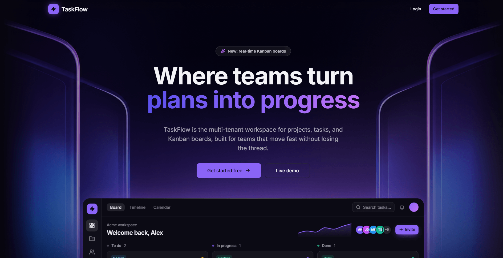
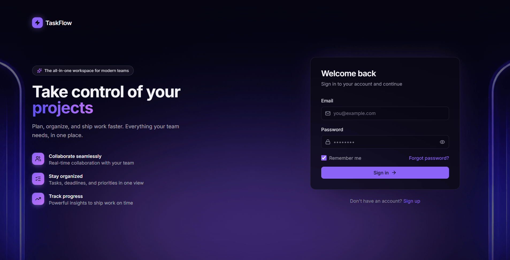
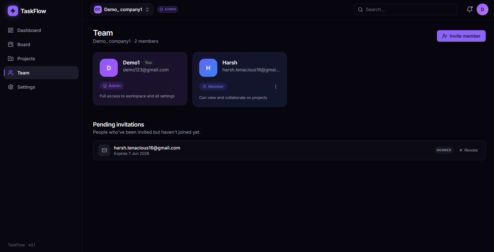

# TaskFlow

**A full-stack, multi-tenant team task manager with a Kanban board, real-time updates, and role-based workspaces.**



TaskFlow is a project and task management app I built end to end. Teams sign up, create isolated workspaces, invite members, and organize their work into projects and tasks on a drag-and-drop Kanban board. Tasks carry assignees, priorities, due dates, subtasks, labels, and threaded comments with `@mentions`. A dashboard summarizes workspace activity with charts, and every connected client stays in sync over WebSockets. The backend is an async FastAPI service backed by PostgreSQL; the frontend is a React single-page app.

---

## Live Demo

- **Frontend:** `https://taskflow-git-main-harshgupta7739-5802s-projects.vercel.app/`
- **API docs (Swagger UI):** `https://team-task-manager-api-mj72.onrender.com/docs`

> ⚠️ **Heads up - the backend sleeps when idle.** The API runs on a free tier that spins down after inactivity, so the **first request can take ~30–60 seconds** to wake the server. Once it's warm, everything is fast. If the login screen seems to hang on the first try, give it a moment and retry.

**Demo login** _(available when the production database has been seeded)_:

| Role   | Email            | Password      |
| ------ | ---------------- | ------------- |
| Admin  | `alice@demo.app` | `demopass123` |
| Member | `bob@demo.app`   | `demopass123` |

---

## Screenshots

### Landing page


### Sign-in page



### Team page



---

## Key Features

- **Authentication** — JWT-based login/signup, with a password-reset flow (request + confirm via emailed reset link).
- **Multi-tenant workspaces** — every team gets an isolated workspace; all data is scoped so workspaces never see each other's projects, tasks, or members.
- **Role-based access control** — two roles per membership, **Admin** and **Member**, with a guard that prevents removing or demoting the last admin.
- **Projects with soft-delete** — projects (and their tasks) are soft-deleted into a trash and can be restored, so nothing is lost by accident.
- **Kanban board** — drag-and-drop across To Do / In Progress / Done columns with an optimistic UI, so cards move instantly and reconcile with the server in the background.
- **Rich tasks** — assignee, status, priority (Low/Medium/High), due dates, checklist subtasks, and color-coded labels.
- **Comments with @mentions** — threaded task discussion that records who was mentioned.
- **Dashboard** — workspace stats and a status breakdown chart (overdue / due-today highlights included).
- **Real-time updates** — changes broadcast over WebSockets so every open client updates live without a refresh.
- **Email invitations** — invite teammates by email, with a **shareable invite link** as a fallback when email isn't configured.
- **Rate limiting** — the email-sending endpoints (invitations, password reset) are throttled to protect the limited free email quota, plus a per-workspace cap on pending invitations.

---

## Tech Stack

### Backend
- **[FastAPI](https://fastapi.tiangolo.com/)** - async web framework
- **PostgreSQL** with **async SQLAlchemy** (`sqlalchemy[asyncio]` + `asyncpg`)
- **Alembic** - database migrations
- **Pydantic v2** + **pydantic-settings** - schemas, validation, and config
- **python-jose** + **passlib[bcrypt]** - JWT auth and password hashing
- **WebSockets** - native FastAPI/Starlette WebSocket support for real-time broadcast
- **slowapi** - rate limiting
- **Uvicorn** - ASGI server
- **pytest** + **pytest-asyncio** + **httpx** - async test suite

### Frontend
- **React 19** + **Vite** (JavaScript, not TypeScript)
- **Tailwind CSS** + **shadcn/ui** (Radix primitives, `lucide-react` icons)
- **TanStack Query** (React Query) - server state, caching, and optimistic updates
- **React Router** - client-side routing
- **Framer Motion** - animations
- **@dnd-kit** (`core` / `sortable` / `utilities`) - drag-and-drop on the board
- **Recharts** - dashboard charts
- **axios** - HTTP client

> Versions are pinned in [`backend/requirements.txt`](backend/requirements.txt) and [`Frontend/package.json`](Frontend/package.json).

---

## Architecture

The backend is **layered**:

- **Routers** (`app/routers/`) handle HTTP/WebSocket I/O and validation.
- **Services** (`app/services/`) hold the business logic.
- **Models** (`app/models/`) are the SQLAlchemy ORM tables.
- **Schemas** (`app/schemas/`) are the Pydantic request/response contracts.

**Multi-tenancy** is enforced by workspace isolation: every project, task, label, comment, and activity ultimately belongs to a workspace, and queries are always scoped to the caller's workspace membership. **Roles live on the membership** (the join between a user and a workspace), so the same user can be an Admin in one workspace and a Member in another.

```
backend/
├── app/
│   ├── core/            # config, database, security, dependencies, rate limiting
│   ├── models/          # SQLAlchemy models (user, workspace, project, task, ...)
│   ├── schemas/         # Pydantic v2 request/response schemas
│   ├── routers/         # API + WebSocket endpoints
│   ├── services/        # business logic
│   ├── realtime/        # WebSocket connection manager
│   ├── notifications/   # email + in-app notification services
│   ├── utils/           # shared query helpers
│   └── main.py          # FastAPI app, middleware, router registration
├── alembic/             # migration environment + versioned migrations
├── tests/               # pytest suite
├── seed.py              # idempotent demo-data seeder
└── requirements.txt

Frontend/
├── src/
│   ├── pages/           # route-level pages (auth, app: Board/Dashboard/Projects/Team/Settings)
│   ├── features/        # feature modules (board, dashboard, projects, team, auth, realtime, ...)
│   ├── components/      # shared UI (shadcn/ui, motion helpers, dialogs)
│   ├── context/         # Auth, Workspace, Theme, Toast providers
│   ├── hooks/           # reusable hooks
│   ├── lib/             # api client, query client, utils
│   ├── App.jsx
│   └── main.jsx
├── index.html
├── vite.config.js
└── package.json
```

---

## Local Setup

### Prerequisites
- **Python 3.11+**
- **Node.js 18+** and npm
- **PostgreSQL** running locally

### 1. Backend

```bash
cd backend

# create + activate a virtual environment
python -m venv .venv
# Windows (PowerShell):
.venv\Scripts\Activate.ps1
# macOS/Linux:
source .venv/bin/activate

# install dependencies (use requirements-dev.txt to also get the test tools)
pip install -r requirements.txt

# create your env file from the template and edit the values
copy .env.example .env        # Windows
# cp .env.example .env         # macOS/Linux

# run migrations
alembic upgrade head

# start the API (http://localhost:8000, docs at /docs)
uvicorn app.main:app --reload
```

### 2. Frontend

```bash
cd Frontend

npm install

# point the app at your backend
copy .env.example .env        # Windows  (cp on macOS/Linux)
# .env contains: VITE_API_BASE_URL=http://localhost:8000

npm run dev
```

The dev server starts on Vite's default port (http://localhost:5173).

### 3. Seed demo data (optional)

From the `backend/` directory, with the venv active and migrations applied:

```bash
python seed.py
```

This is **idempotent** — re-running wipes and recreates the demo workspace. It creates a "Demo Workspace" with two users (`alice@demo.app` / admin and `bob@demo.app` / member, both password `demopass123`), plus sample projects, tasks, labels, subtasks, and comments.

---

## Environment Variables

Only **`.env.example`** is committed; the actual **`.env`** files are gitignored. Copy the example and fill in real values.

### Backend (`backend/.env.example`)

| Variable                      | Description                                                                 |
| ----------------------------- | --------------------------------------------------------------------------- |
| `DATABASE_URL`                | Postgres connection string (async). `postgres://`/`postgresql://` URLs are auto-normalized to the `asyncpg` driver. |
| `JWT_SECRET`                  | Secret used to sign JWTs — **change this in production**.                    |
| `JWT_ALGORITHM`               | JWT signing algorithm (default `HS256`).                                    |
| `ACCESS_TOKEN_EXPIRE_MINUTES` | Access-token lifetime in minutes (default `60`).                            |
| `EMAIL_PROVIDER`              | Email provider, `resend` or `sendgrid`.                                     |
| `EMAIL_API_KEY`               | API key for the email provider. **If empty, emails are logged instead of sent** (invite links still work). |
| `EMAIL_FROM`                  | The "from" address for outgoing email.                                      |
| `FRONTEND_URL`                | Base URL of the frontend, used to build invite and password-reset links.    |
| `RATE_LIMIT_ENABLED`          | Toggle rate limiting on/off (default `true`).                               |
| `RATE_LIMIT_INVITATION`       | Rate limit for invitation sends (default `5/minute;20/hour`).               |
| `RATE_LIMIT_PASSWORD_RESET`   | Rate limit for password-reset requests (default `3/hour`).                  |
| `MAX_PENDING_INVITATIONS_PER_WORKSPACE` | Cap on unaccepted invitations per workspace (default `20`).       |

### Frontend (`Frontend/.env.example`)

| Variable            | Description                                  |
| ------------------- | -------------------------------------------- |
| `VITE_API_BASE_URL` | Base URL of the backend API.                 |

---

## Testing

The backend has an async test suite (`pytest` + `pytest-asyncio` + `httpx`) covering auth, RBAC, workspace membership, the last-admin guard, soft-delete cascades, and invitation/rate limits — **17 tests** in total.

The tests run against a real PostgreSQL instance (they create and tear down a dedicated `*_test` database), so make sure Postgres is running and `DATABASE_URL` is set first.

```bash
cd backend
pip install -r requirements-dev.txt   # pytest, pytest-asyncio, httpx
pytest
```

Rate limiting is disabled automatically during tests so the suite isn't throttled.

---

## Deployment

TaskFlow is deployed across three services:

- **Backend (FastAPI)** → [Render](https://render.com/)
- **Database (PostgreSQL)** → [Neon](https://neon.tech/)
- **Frontend (React/Vite)** → [Vercel](https://vercel.com/)

The backend runs on a free tier that sleeps when idle, which is why the first request after a period of inactivity takes a little longer to respond (see the demo note above).
